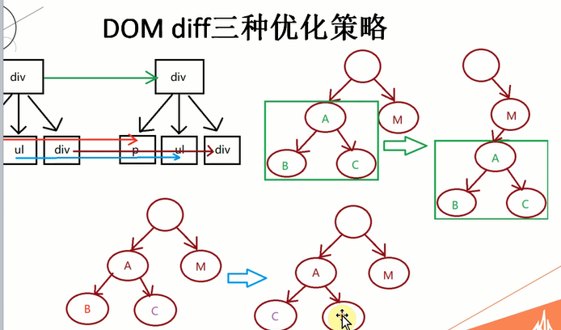
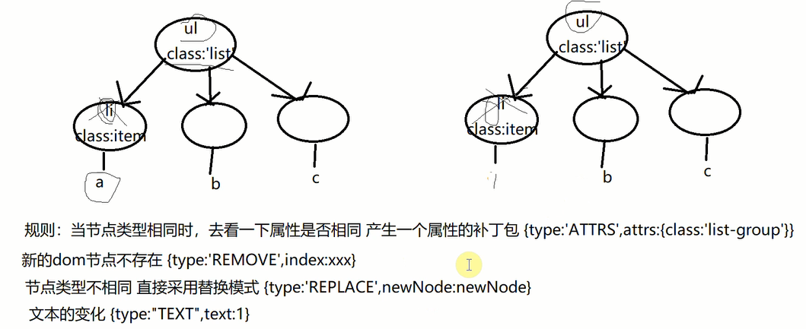

# virtualDOM

### environment
```
npm i -g create-react-app
create-react-app dom-diff
```

### virtual-dom
createElemtn => {type, props, children}

### React优化策略(深度遍历)
- 一层一层比
- 不会跨级比
- 同层会复用,根据key



### 生成patch Object



### issue
- 平级元素互换
- 新增节点也不会更新 index